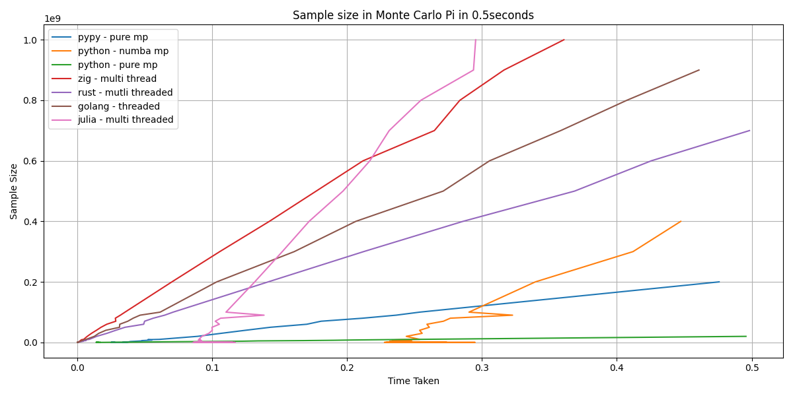
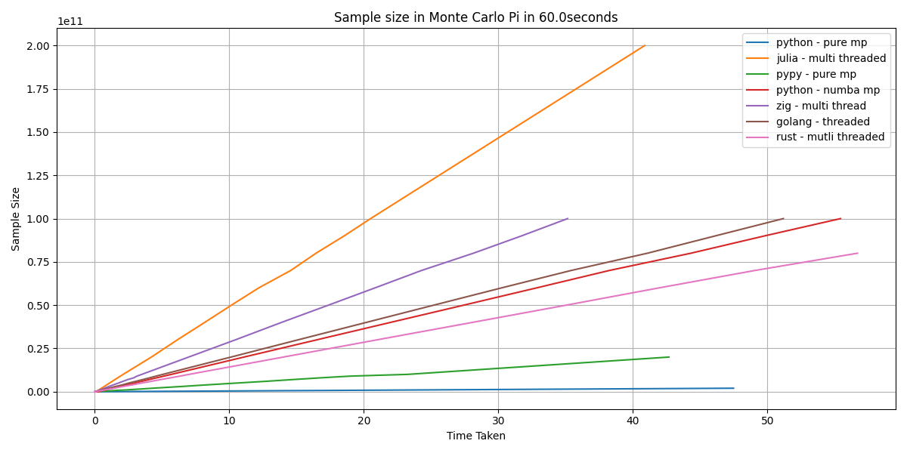

# testing_ground
This repo it used to run tests that compare languages. It should not be used to prove one language is better, but to show how it all depends.

The results from this exploratory work is currently being turned into a blog. 
Here are two images from different test runs. 
There was some very interesting findings.

